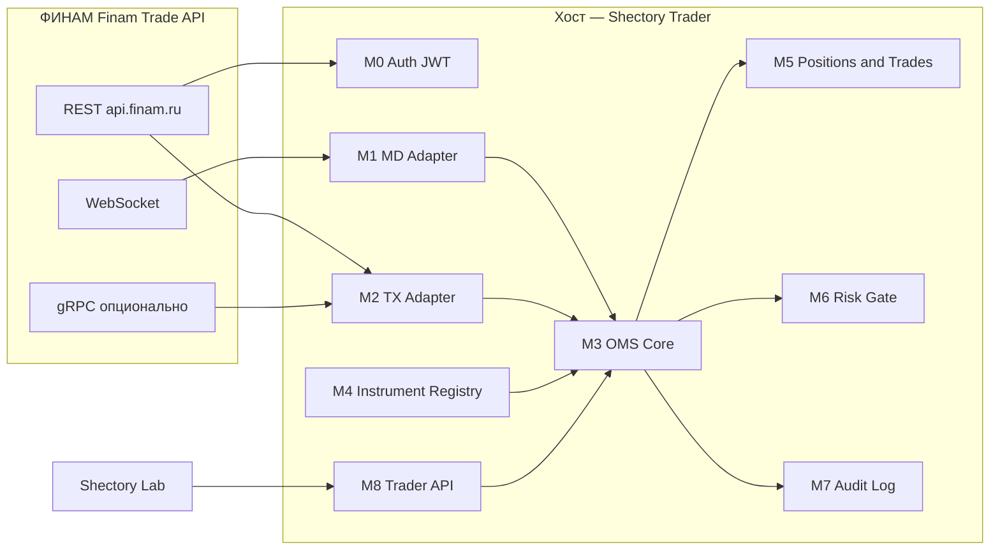

# Техническое задание  
# Платформа исполнения «Shectory Trader» — **Finam Trade API** (ФИНАМ)

| Поле | Значение |
|------|----------|
| Версия документа | 2.1 |
| Дата | 2026-04-16 |
| Статус | Проект ТЗ, к согласованию |
| Владелец продукта | Shectory |
| Связанная система | «Shectory Lab» — торговые стратегии; доступ к исполнению только через **Trader API** платформы |

---

## 1. Назначение и границы

### 1.1. Назначение

**Shectory Trader** — исполнительная платформа для срочного рынка (и иных рынков, доступных по счёту ФИНАМ): получение рыночных данных и управление заявками через **Finam Trade API**, учёт сделок и позиций по данным брокера, **журнал аудита** (append-only). Платформа **не** содержит логику торговых стратегий.

### 1.2. Источник данных и торговли

Единый внешний контур: **[Finam Trade API](https://api.finam.ru/)** — REST (`api.finam.ru`), при необходимости **gRPC** и **WebSocket** для потоков (стакан, сделки и др. в составе, заявленном в документации ФИНАМ).

> **Про стоимость API:** отдельная абонентская плата за доступ к Trade API в публичной модели ФИНАМ для разработчика **не фигурирует** как обязательная плата «за ключ»; действуют **комиссии за сделки**, условия счёта и **лимиты** (см. раздел 10 и приложение А). Актуальные условия — только в документации и личном кабинете ФИНАМ.

### 1.3. Не входит в объём

- Разработка стратегий внутри Trader (система **Shectory Lab**).
- Юридическое сопровождение и подбор тарифов брокера (ответственность владельца продукта; в ТЗ — технические требования).

---

## 2. Цели

1. Выпустить **MVP** с полным сценарием «hello world» на одном инструменте (раздел 3).
2. Довести систему до **промышленной** эксплуатации на **VDS Ubuntu**: устойчивость, журнал, риск-ограничения, **Trader API** для Lab.
3. Обеспечить **документацию и задел** на сопровождение: runbook, конфигурация, расширяемые адаптеры.

---

## 3. Инструмент MVP (эталон сценария)

| Поле | Значение |
|------|----------|
| Серия (FORTS), ориентир | **GAZR-6.26** |
| Короткий код (биржа) | **GZM6** |
| Идентификатор в Finam Trade API | Строка **`SYMBOL@MIC`**; **не** подставлять слепо `GZM6`. Значение получается из **справочника инструментов** API по счёту и фиксируется в конфигурации (`docs/config/MVP.symbol.example.yaml` или аналог по итогам этапа 3). |

---

## 4. Архитектура

| Поток | Реализация | Назначение |
|-------|------------|------------|
| Рыночные данные | WS / REST по документации | Стакан, обезличенные сделки (в объёме, доступном API) |
| Торговля | REST / gRPC | Создание, изменение, отмена заявок |
| Портфель / сделки / счёт | REST | Позиция, история, состав портфеля по счёту |
| Управление | **Trader API** | Команды от Lab, события исполнения наружу |

**Задержка:** определяется цепочкой «Lab / Trader → сеть → ФИНАМ → биржа»; в ТЗ не задаётся числовой SLA, только требования к устойчивости (раздел 9).

---

## 5. Модули

| Модуль | Назначение |
|--------|------------|
| **M0. Auth** | Secret-токен → JWT; обновление до истечения срока; учёт ограничений ФИНАМ (HTTP/2). |
| **M1. MD Adapter** | Подписки на стакан и рыночные события по выбранному `symbol@mic`. |
| **M2. TX Adapter** | Вызовы методов заявок (создание, изменение, отмена) в рамках спецификации API. |
| **M3. OMS Core** | Состояния заявок; связь `client_order_id` ↔ идентификаторы ФИНАМ; идемпотентность при повторах. |
| **M4. Instrument Registry** | Загрузка и кэш инструментов; лот, шаг цены, допустимые типы заявок. |
| **M5. Positions & Trades** | Агрегация исполнений и сверка с ответами API / портфелем. |
| **M6. Risk Gate** | Предторговые лимиты (объём, дневной стоп, запрет без связи с API и т.д.). |
| **M7. Audit Log** | Журнал **только с дописыванием** (append-only): команды Lab, исходящие к ФИНАМ, ответы, сделки. |
| **M8. Trader API** | Внешний контракт для Shectory Lab (REST и/или gRPC и/или WebSocket — на этапе проектирования API). |
| **M9. Operator UI** | Опционально: аварийный стоп, просмотр состояния. |
| **M10. Config & Secrets** | Конфигурация окружений; секреты вне репозитория. |

---

## 6. MVP «Hello world» — критерии приёмки

| № | Функция | Критерий приёмки |
|---|---------|------------------|
| 1 | Стакан | По зафиксированному `symbol@mic` отображается книга (не менее N уровней bid/ask); обновление из потока или опроса по правилам API. |
| 2 | Покупка 1 контракта | Успешный ответ **PlaceOrder**; запись в OMS и в журнале. |
| 3 | Перенос заявки | Успешный вызов **изменения** заявки (цена/объём — в рамках поддержки API); до/после в журнале. |
| 4 | Учёт сделки | Исполнение отражено в учёте позиции и в журнале. |
| 5 | Закрытие позиции | Встречная заявка; позиция по инструменту **0** в модели Trader и согласованно с данными портфеля API. |
| 6 | Журнал цикла | Один **`trace_id`** на сценарий; полная трассировка шагов с метками времени. |

**Ограничения среды ФИНАМ (обязательны к учёту в реализации):** лимит запросов (**до 200 вызовов/мин на метод** — уточнять по актуальной документации); **ежедневное обслуживание 05:00–06:15 МСК**; возможный **разрыв WebSocket раз в 24 ч** от начала подписки — автоматическое переподключение.

---

## 7. Интерфейс с «Shectory Lab»

- **Команды (примерный набор):** размещение, замена, отмена заявки; подписка на стакан; аварийная остановка торговли через Trader.
- **События наружу:** обновление стакана, статус заявки, сделка, ошибка, состояние сессии с API.
- **Транспорт и версии:** фиксируются в отдельном документе **«Контракт Trader API»** по завершении этапа 7 (OpenAPI/proto + политика версионирования).

---

## 8. Нефункциональные требования

- REST только поверх **HTTP/2** (рекомендация ФИНАМ).
- Секреты не хранятся в Git; ротация токенов по регламенту ФИНАМ.
- Логи и журнал аудита: ротация по размеру/дням; права доступа к файлам на хосте.
- Ретраи с **exponential backoff** при 429/5xx с учётом лимита вызовов.

---

## 9. Риски

| Риск | Митигация |
|------|-----------|
| Изменение API ФИНАМ | Зафиксированная версия клиента в `CHANGELOG`; мониторинг официальных каналов. |
| Недоступность брокера в окне обслуживания | Планирование работ и алерты; отказоустойчивое поведение (не отправлять заявки вслепую). |
| Неверный `symbol@mic` | Обязательный этап 3; автоматический поиск по справочнику + ручное подтверждение. |

---

## 10. Этапы реализации (включая MVP)

Каждый этап **закрывается** только при выполнении **всех** критериев выхода. Длительность в календаре не фиксируется — только содержание.

---

### Этап 0. Доступы и счёт

| | |
|--|--|
| **Цель** | Возможность законно вызывать Finam Trade API с выбранного счёта. |
| **Вход** | Решение о типе счёта (демо для разработки / боевой); готовность владельца пройти идентификацию у ФИНАМ. |
| **Результат (выход)** | Открытый счёт (или демо, если правила ФИНАМ допускают); выпущен **secret-токен** на [портале токенов](https://api.finam.ru/tokens); заполнен **реестр доступа** (шаблон: `docs/runbooks/finam-access-checklist.md` или эквивалент в репозитории после создания). |
| **Критерий готовности** | Успешный ручной вызов **Auth** → получение JWT из рабочей станции разработчика или CI-секрета. |

---

### Этап 1. Репозиторий, окружения, секреты

| | |
|--|--|
| **Цель** | Каркас продукта и безопасная работа с секретами. |
| **Вход** | Завершён этап 0. |
| **Результат** | Монорепозиторий (или согласованная структура); `README` с целями проекта; **`.env.example`** без секретов; целевой стек (язык) зафиксирован в `README` или `ADR-0001`; минимальный **CI** (линт + unit-заглушки). |
| **Критерий готовности** | Сборка и CI зелёные на пустом модуле; секреты не в коммитах. |

---

### Этап 2. Модуль M0 — аутентификация Finam

| | |
|--|--|
| **Цель** | Стабильное получение и обновление JWT. |
| **Вход** | Этап 1; secret в окружении CI/локально. |
| **Результат** | Код M0; интеграционный тест на обмен secret→JWT; документ **«Подключение к API»** в `docs/` (как обновлять токен, где лежат переменные). |
| **Критерий готовности** | Тест проходит против демо/боевого API (по выбранному контуру); логируется только маскированный статус, не secret. |

---

### Этап 3. M4 — справочник инструментов и символ MVP

| | |
|--|--|
| **Цель** | Однозначный `symbol@mic` для сценария GAZR/GZM6. |
| **Вход** | Этап 2; известный `account_id` в формате, требуемом API. |
| **Результат** | Код загрузки списка инструментов; **зафиксированный** в конфиге MVP символ; запись в `docs/config/MVP-instrument.md` (человекочитаемо: что выбрано и почему). |
| **Критерий готовности** | Ручная или автоматическая проверка: по этому символу доступны торги и котировки на счёте. |

---

### Этап 4. M1 — рыночные данные (стакан)

| | |
|--|--|
| **Цель** | Воспроизводимый поток или снимок стакана по символу MVP. |
| **Вход** | Этап 3. |
| **Результат** | M1; нормализованная внутренняя модель книги; обработка разрыва WS (переподключение); метрика «время получения события на хосте». |
| **Критерий готовности** | В течение сессии стакан обновляется без утечки памяти за N часов (N задаётся в тест-плане этапа, например 2). |

---

### Этап 5. M2 + M3 — заявки и OMS

| | |
|--|--|
| **Цель** | Создание, отмена и изменение заявки через API с учётом состояний OMS. |
| **Вход** | Этап 3 (символ); этап 2 (JWT). |
| **Результат** | M2, M3; маппинг внешних id; модульные тесты на переходы состояний (мок API допускается); раздел в **runbook**: типичные коды отказов ФИНАМ. |
| **Критерий готовности** | На демо/тестовом контуре выполняются **Place** и **Cancel** без расхождения состояния OMS и ответа API. |

---

### Этап 6. M5 + M7 — позиции, сделки, журнал аудита

| | |
|--|--|
| **Цель** | Учёт после исполнения и неизменяемый журнал. |
| **Вход** | Этап 5. |
| **Результат** | M5; M7 append-only; формат строки журнала (поля из приложения Б); сверка «последняя сделка / позиция» с ответом API портфеля. |
| **Критерий готовности** | После контрольной сделки позиция в Trader совпадает с брокерским API в пределах оговоренной задержки опроса (например, ≤ 60 с, если только polling). |

---

### Этап 7. MVP — сквозной сценарий «hello world»

| | |
|--|--|
| **Цель** | Один сценарий: стакан → покупка 1 лота → перенос → фиксация сделки → закрытие → журнал с `trace_id`. |
| **Вход** | Этапы 4, 5, 6. |
| **Результат** | Скрипт или CLI `trader mvp-demo`; **чек-лист приёмки MVP** (`docs/acceptance/MVP-checklist.md`); запись демо (видео или лог-файл) по усмотрению владельца. |
| **Критерий готовности** | Все строки таблицы раздела 6 выполнены и отмечены в чек-листе. |

---

### Этап 8. M8 — Trader API для Shectory Lab

| | |
|--|--|
| **Цель** | Внешний контракт для стратегий без прямого доступа к ключам ФИНАМ. |
| **Вход** | Этап 7. |
| **Результат** | Документ **«Контракт Trader API»** (OpenAPI 3.x или proto + краткое README); реализация сервера M8; аутентификация между Lab и Trader (mTLS или токен на приватном интерфейсе). |
| **Критерий готовности** | Минимальный **mock Lab** или Postman-коллекция проходит сценарий: команда на заявку → событие в стриме Trader. |

---

### Этап 9. M6 + промышленная эксплуатация

| | |
|--|--|
| **Цель** | Ограничение риска и эксплуатация на VDS. |
| **Вход** | Этап 8 (или параллельно часть M6 после этапа 5 — по решению команды, но **критерий этапа 9** закрывается после 8). |
| **Результат** | M6: лимиты в конфиге; **runbook прод** (`docs/runbooks/production.md`): деплой, перезапуск, окно 05:00–06:15 МСК, алерты; резервное копирование журнала; health-endpoint. |
| **Критерий готовности** | Успешный прогон чек-листа прод на стенде, имитирующем VDS; ответственный за смены подписал ознакомление с runbook. |

---

## Приложение А. Справочник Finam Trade API (старт)

- [Быстрый старт](https://api.finam.ru/getting-started)  
- [REST](https://api.finam.ru/docs/rest)  
- [gRPC](https://api.finam.ru/docs-new/grpc-new)  
- [Async / WebSocket](https://api.finam.ru/docs-new/async-api-new/#introduction)  
- Репозиторий протофайлов: [FinamWeb/finam-trade-api](https://github.com/FinamWeb/finam-trade-api)  

Юридический пакет с брокером запрашивается у ФИНАМ отдельно (договор, регламенты API).

---

## Приложение Б. Минимальный набор полей строки журнала аудита

`ts_utc`, `trace_id`, `module`, `event_type`, `account_id` (маскированно при необходимости), `symbol`, `side`, `qty`, `price`, `client_order_id`, `broker_order_id`, `http_status` или код API, `text` (без секретов).

---

## История изменений

| Версия | Дата | Изменение |
|--------|------|-----------|
| 2.1 | 2026-04-16 | Автономное ТЗ без сравнения с другими версиями; добавлены этапы 0–9 с входом/выходом |
| 2.0 | 2026-04-16 | Первоначальная версия на Finam Trade API |
